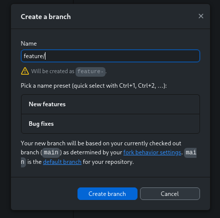
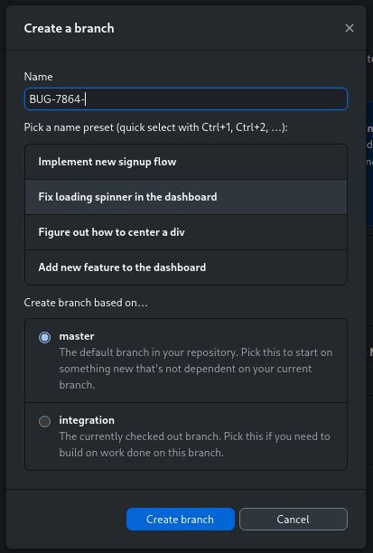

# Generating Branch Name Presets

The app allows you to provide a script for generating branch name presets. This is useful for quickly selecting a branch name (or prefix) from a list instead of typing it out manually.

After picking the name, you can edit it before creating the branch.

|  |  |
|------------------------------------------|------------------------------------------|
| Hardcoded `feature/` and `bugfix/` presets. | Fetching ID + title from an issue tracker. |

### Step 1: Create the script

Your script can perform any arbitrary logic, such as fetching issues from a repository or Jira server.

The script must output a list of presets, one per line. Each line consists of 2 parts separated by a **space**:
1. The branch name. It will be used to populate the text field in the UI.
2. The description of the preset (optional). Text that will be shown in the selector list. If not provided, the branch name will be used.

See below for examples.

### Step 2: Make the script executable
Make sure the script is executable. You can do this by running the following command in your terminal:

```bash
chmod +x /path/to/your/script.sh
```

### Step 3: Configure GitHub Desktop

1. Open GitHub Desktop.
1. Open the Preferences window (`Ctrl + ,` on Windows/Linux, `Cmd + ,` on macOS).
1. Go to the "Integrations" tab.
1. Under "Generate branch name presets", click "Choose..." to open the file picker and select your script.
1. Click "Save" to apply the changes.

> [!IMPORTANT]
> If your script needs to return different values depending on the current repository, make sure that the "Arguments" field contains `%TARGET_PATH%`, which will be replaced with the full path of the repository.

## Example Scripts

**Example 1: Commonly used prefixes**

```bash
#!/bin/bash

# Provide a list of common prefixes. The user can fill in the name after selecting a prefix
echo "feature/" "New features"
echo "bugfix/" "Bug fixes"
```

**Example 2: Fetching tickets from a Jira server**

```py
#!/bin/env python3

import requests
from requests.auth import HTTPBasicAuth
import json

JIRA_DOMAIN = "your-domain.atlassian.net"
JIRA_LOGIN = "your_email@example.com"
# https://id.atlassian.com/manage-profile/security/api-tokens
JIRA_API_TOKEN = "<api_token>"

QUERY = 'assignee = currentUser() AND status = "In Progress" ORDER BY created DESC'

response = requests.request(
    "GET",
    url=f"https://{JIRA_DOMAIN}/rest/api/3/search/jql",
    headers={ "Accept": "application/json" },
    params={'jql': QUERY, 'fields': 'summary'},
    auth=HTTPBasicAuth(JIRA_LOGIN, JIRA_API_TOKEN)
)

for issue in response.json()['issues']:
    issue_key = issue['key']
    issue_summary = issue['fields']['summary']
    branch_prefix = issue_key + "-"
    preset_description = f"[{issue_key}] {issue_summary}"
    print(branch_prefix, preset_description)
```

**Example 3: Conditional logic depending on the repository**

```bash
#!/bin/bash
REPO_PATH="$1"
REPO_NAME=$(basename "$REPO_PATH")
REPO_DIR=$(basename "$(dirname "$REPO_PATH")")

if [[ "$REPO_NAME" == "special-repo" ]]; then
    echo "special-feature/" "Special feature branch"
fi

if [[ "$REPO_DIR" == "my-org" ]]; then
    echo "FEAT-" "New features"
    echo "FIX-" "Bug fixes"
else
    echo "feature/" "New features"
    echo "bugfix/" "Bug fixes"
fi

# Common presets in all repositories
echo "hotfix/" "Hotfix"
echo "release/" "Release branch"
```
